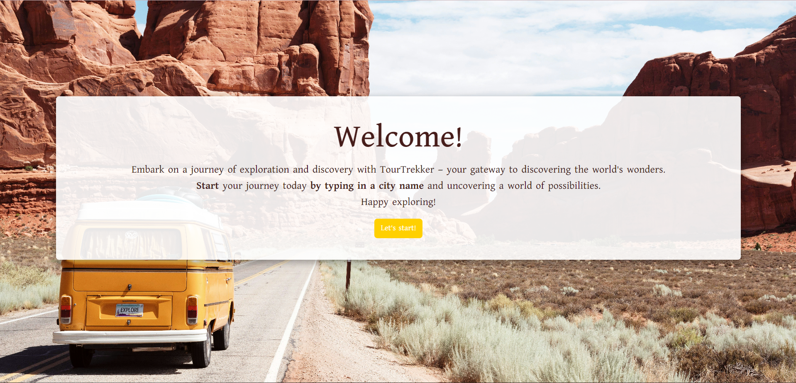

# TourTrekker

Welcome to TourTrekker Weather App, your go-to application for checking the latest weather updates and forecasts for cities around the globe. TourTrekker offers a seamless user experience with a wide range of features designed to keep you informed and prepared for any weather conditions.

## Languages Used
   

## Libraries Used
    

## Table of Contents
- [Features](#features)
- [Installation and Setup](#installation-and-setup)
- [Usage](#usage)
- [Screenshots](#screenshots)
- [Live Deployment](#live-deployment)
- [Repository](#repository)
- [Credits](#credits)
- [Contributing](#contributing)
- [License](#license)

## Features
- **Real-time Weather Updates:** Get instant access to current weather data, including temperature, humidity, wind speed, and more.
- **5-Day Forecast:** Plan ahead with a detailed forecast for the next five days, helping you make informed decisions for your activities.
- **Dynamic Background Images:** Enjoy stunning background images that change based on the selected city, providing a visually immersive experience.
- **Search Functionality:** Easily search for any city worldwide to retrieve weather information quickly.
- **Information Page:** Learn more about TourTrekker and its features through the integrated information page.
- **Wikipedia Integration:** Dive deeper into the selected city's details with integrated Wikipedia information, offering insights into its history, culture, and more.

## Installation and Setup
To run TourTrekker Weather App locally on your machine, follow these steps:
1. Clone the repository to your local environment.
2. Navigate to the project directory.
3. Install dependencies using `npm install`.
4. Run the development server with `npm run dev`.
5. Access the application in your web browser at `http://localhost:xxxx`.

## Usage
### Landing Page:
- Upon opening the app, you'll land on the welcome page.
- Click on "Let's start!" to proceed.
### Home Page:
- Navigate to the Info page by clicking on the navigation button.
- Learn more about TourTrekker and its features.
### Forecast Page:
- Enter a city name.
- Here, you'll see the current weather information for the selected city.
- Scroll down to view the 5-day forecast with detailed weather data for each day.
### Wikipedia Integration:
- Explore interesting facts about the selected city on the Places page.
- Click on "Read More" to dive deeper into Wikipedia information.
### Navigation:
- Use the navigation bar at the bottom to switch between pages.

## Screenshots

## Live Deployment
You can access the live deployment of TourTrekker Weather App: [https://tourtrekkerapp.netlify.app/](#).

## Repository
The source code for TourTrekker Weather App is available on GitHub:
[https://github.com/fishmon/TourTrekker](#)

## Credits
- OpenWeatherMap: Weather data API provider for real-time and forecast weather information.
- Unsplash: Source of beautiful background images related to cities.
- Wikipedia: Provider of city information integrated into the application.

## Contributing
We welcome contributions from the community! Feel free to fork this repository, make your enhancements, and submit a pull request.

## License
This project is licensed under the MIT License - see the LICENSE file for details.

##Colaborators :
- [@Danilo](https://github.com/DaniloRua)
- [@Natallia](https://github.com/natalie-0073)
- [@Adrian](https://github.com/fishmon)
- [@Iryna](https://github.com/iabramidze)

Thank you for using our TourTrekker Weather App! If you have any questions or feedback, please don't hesitate to reach out. Happy exploring! 🌤️
